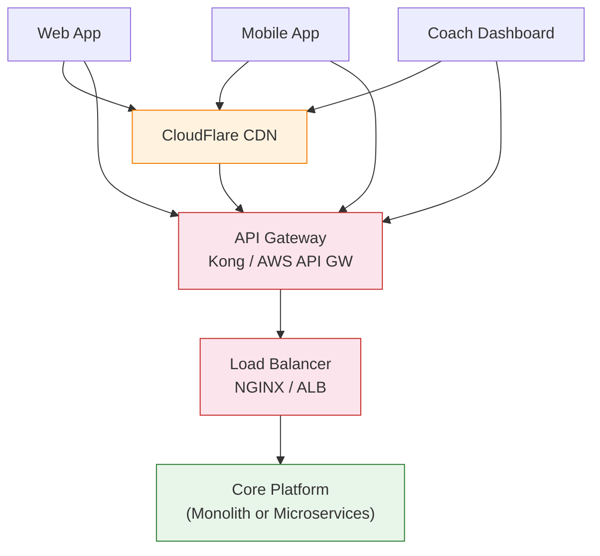
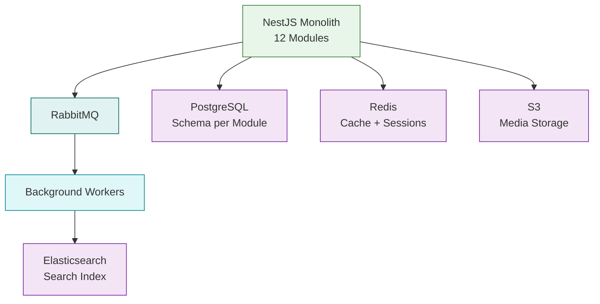
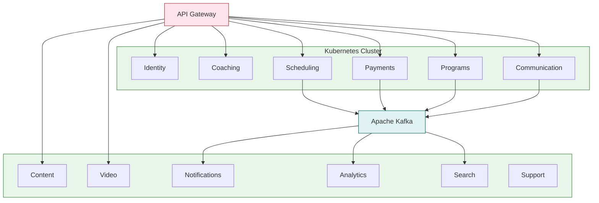
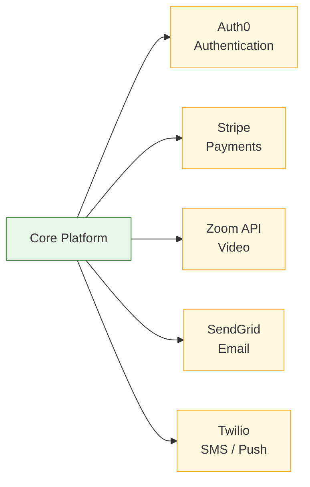
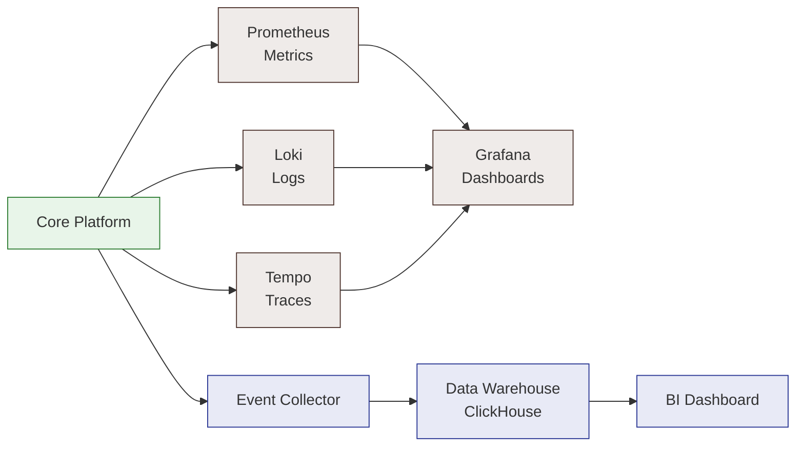

# High-Level System Architecture (C4 Context)

This section shows how external actors and internal systems interact with the platform. The diagrams are split by concern so each one is readable on its own.

---

## 1A. Request Flow — How Traffic Reaches the Application

---

## 1B. Approach A — Modular Monolith Overview

---

## 1C. Approach B — Microservices Overview

---

## 1D. External Services

---

## 1E. Observability & Analytics

