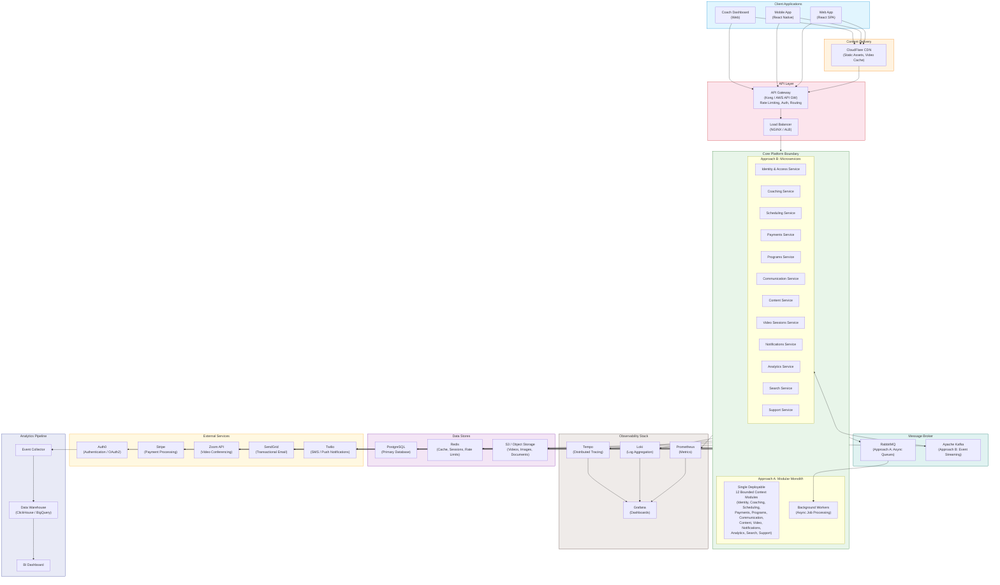

# Diagram 1: High-Level System Architecture (C4 Context)

This C4-style context diagram shows how external actors (clients, third-party services) interact with the platform's core application boundary. The internal box represents either a single deployable monolith (Approach A) or a set of independently deployed microservices (Approach B). All external dependencies are shown at the edges.

