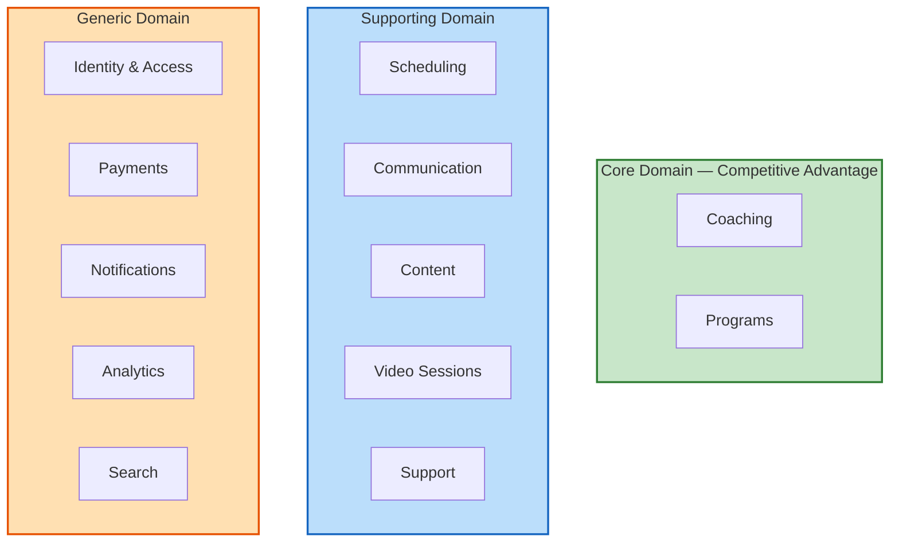
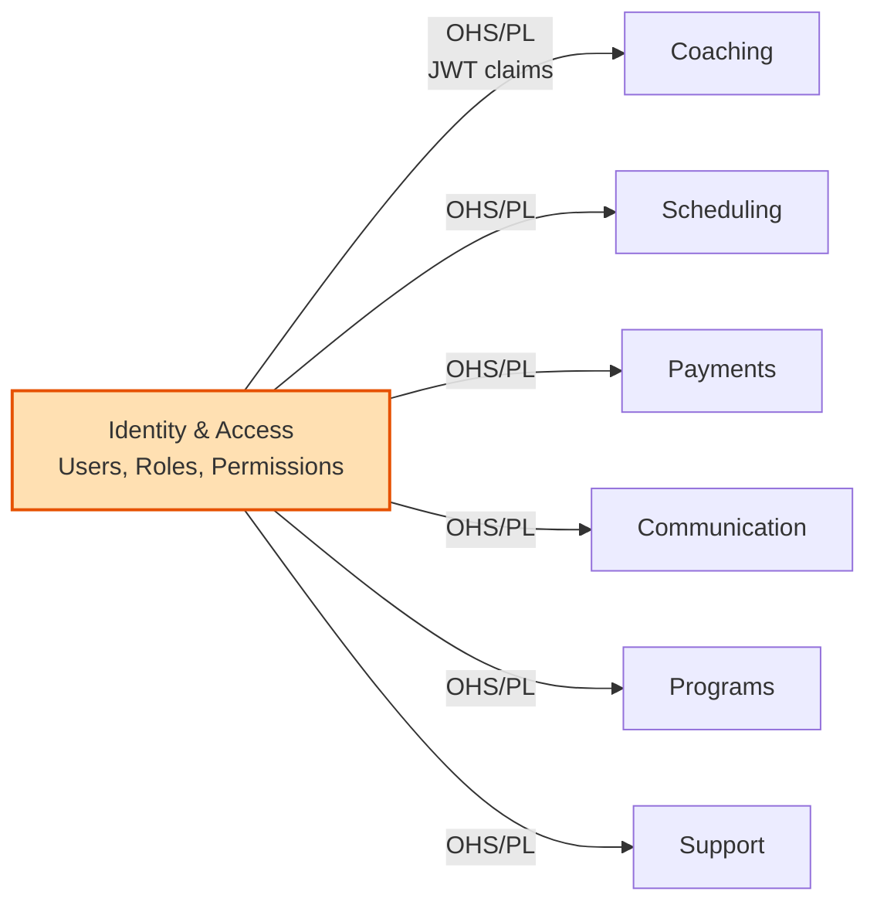
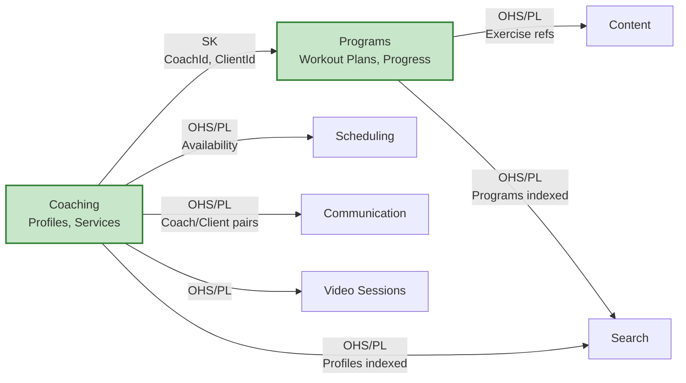
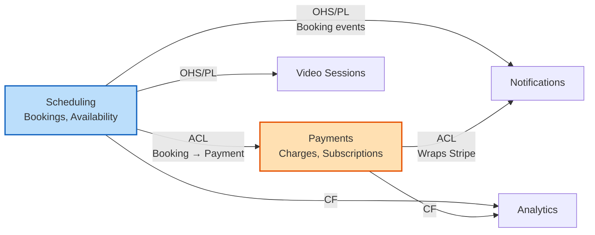
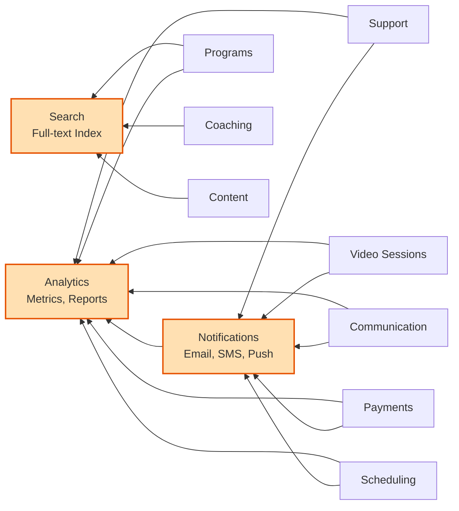

# DDD Bounded Context Map

The 12 bounded contexts are split into three domain types. Each diagram below focuses on one set of relationships so the connections are readable.

---

## Domain Classification

---

## Identity — Upstream to Everything

Identity & Access is the authority for user data. All other contexts depend on it.

---

## Core Domain Relationships

Coaching and Programs are the platform's core value. They feed data to Scheduling, Communication, Content, Search, and Video.

---

## Scheduling & Payments Flow

Scheduling creates bookings. Payments processes charges. Events flow to Notifications and Analytics.

---

## Event Consumers — Notifications, Analytics, Search

These three contexts consume events from nearly every other context.

---

## Relationship Legend

| Pattern | Abbreviation | Description |
|---|---|---|
| Open Host Service / Published Language | OHS/PL | Upstream exposes a well-defined API and published events |
| Anti-Corruption Layer | ACL | Downstream translates upstream models to protect its own domain |
| Conformist | CF | Downstream adopts the upstream model as-is |
| Shared Kernel | SK | Two contexts share a small, co-owned model (e.g., CoachId, ClientId) |
