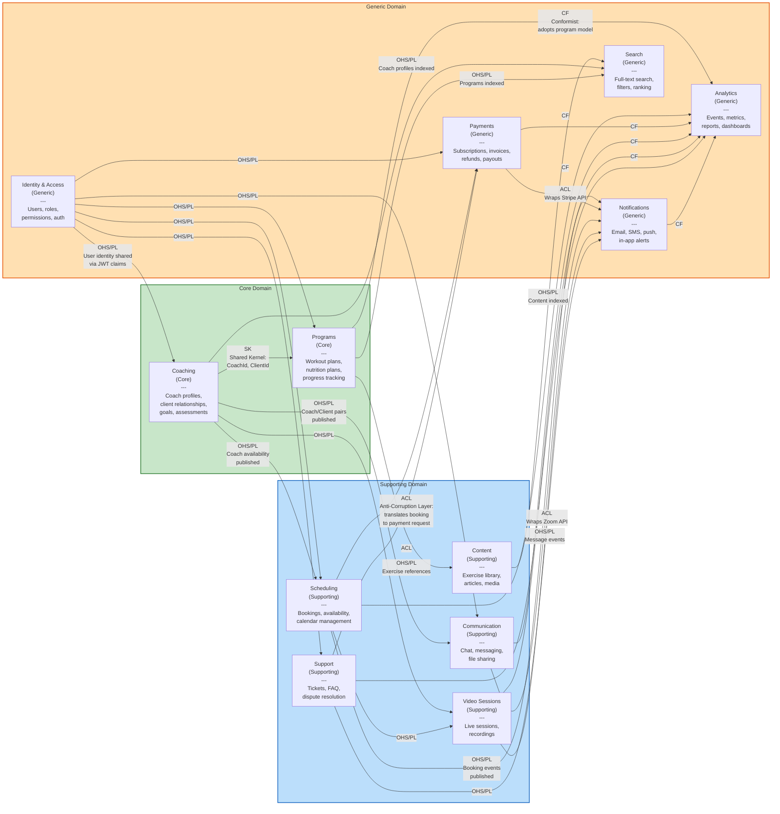

# Diagram 2: DDD Bounded Context Map

This diagram shows all 12 bounded contexts and the strategic DDD relationships between them. Arrows indicate upstream-to-downstream dependency direction. Labels on the edges describe the integration pattern used: ACL (Anti-Corruption Layer), CF (Conformist), SK (Shared Kernel), OHS (Open Host Service), or PL (Published Language).

**Relationship Legend:**

| Pattern | Abbreviation | Description |
|---|---|---|
| Open Host Service / Published Language | OHS/PL | Upstream exposes a well-defined API and published events |
| Anti-Corruption Layer | ACL | Downstream translates upstream models to protect its own domain |
| Conformist | CF | Downstream adopts the upstream model as-is |
| Shared Kernel | SK | Two contexts share a small, co-owned model (e.g., CoachId, ClientId) |
