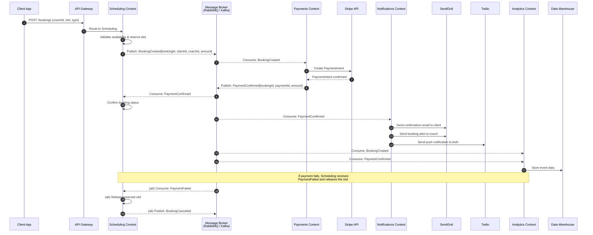
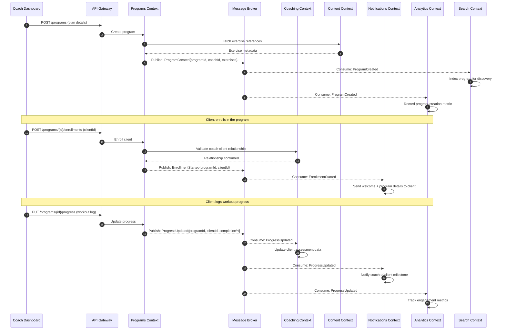
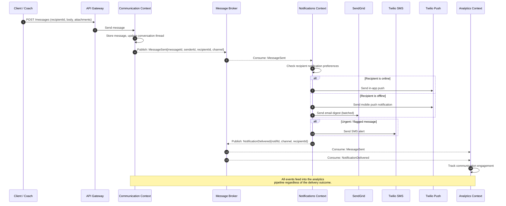

# Diagram 3: Event Flow Diagram

This sequence diagram shows the three primary event flows through the system. Domain events are the backbone of decoupled communication, whether delivered via RabbitMQ queues (Approach A) or Kafka topics (Approach B).

### Flow 1: Booking and Payment

### Flow 2: Program Enrollment and Progress

### Flow 3: Communication and Notifications

