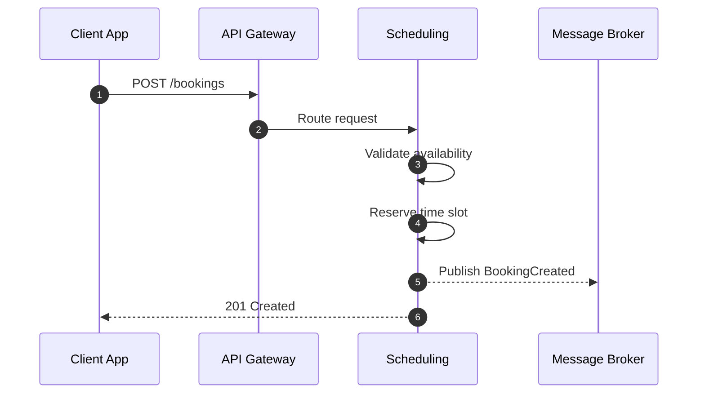
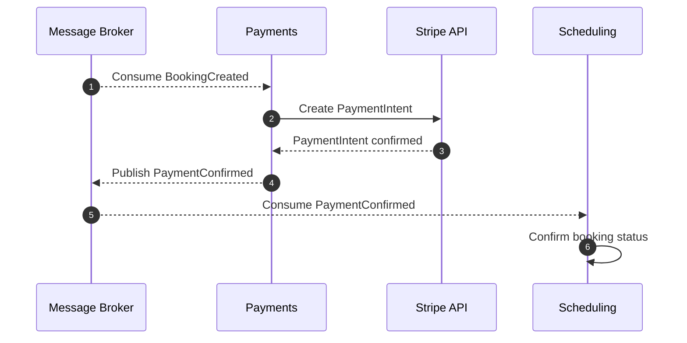
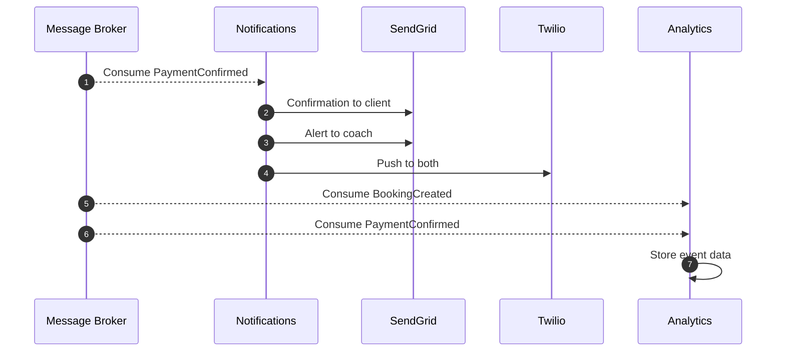
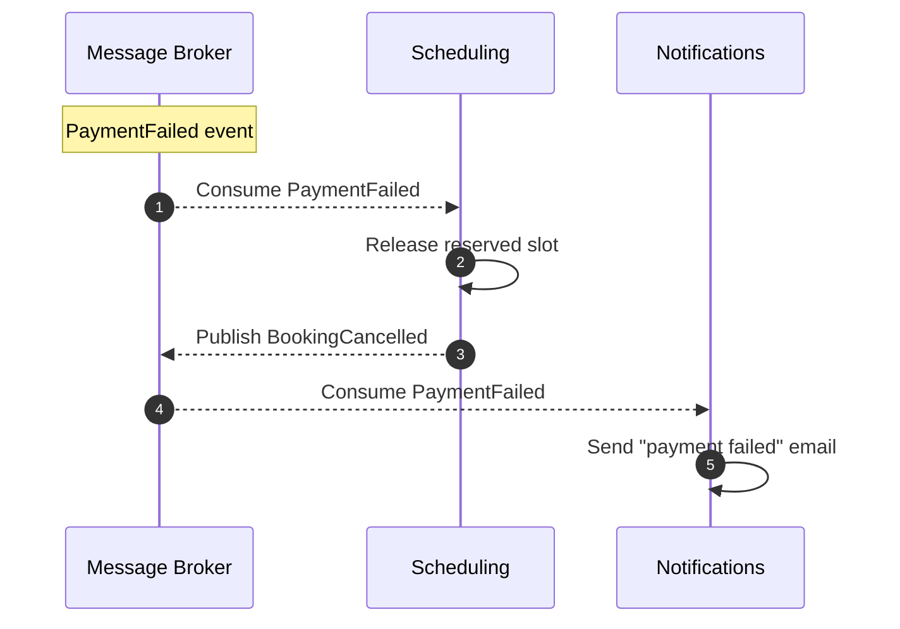
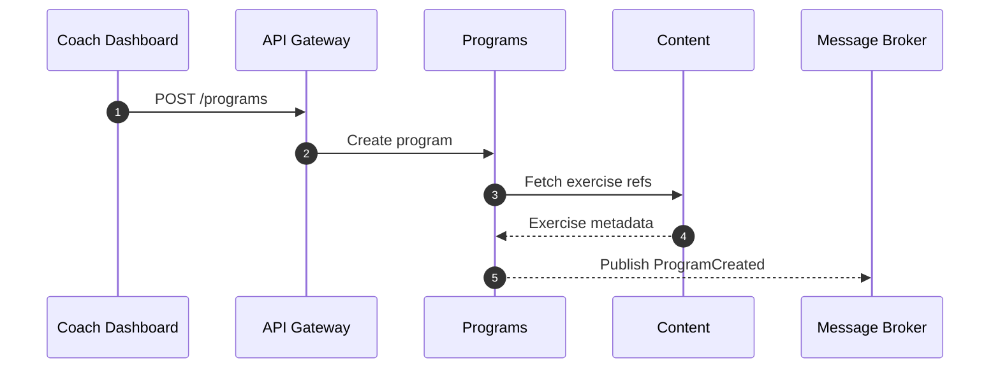
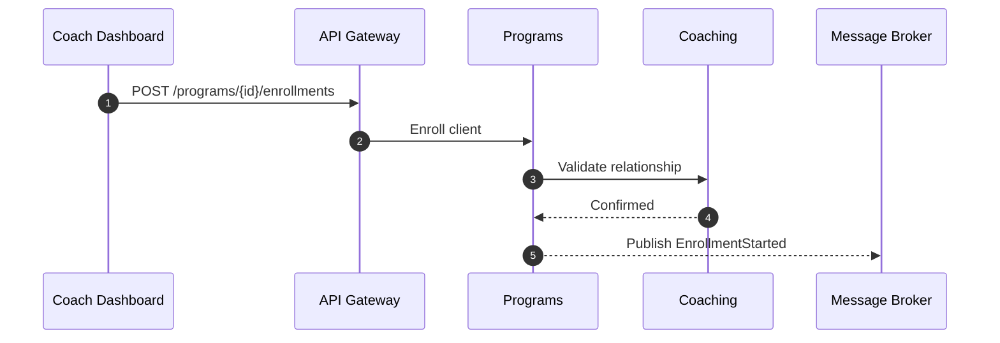
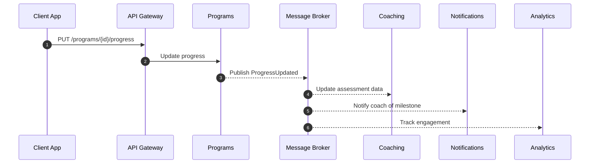
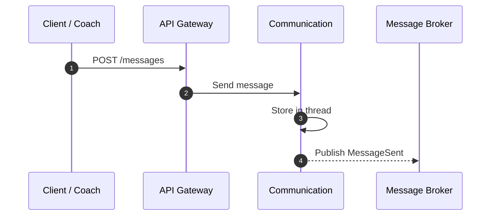
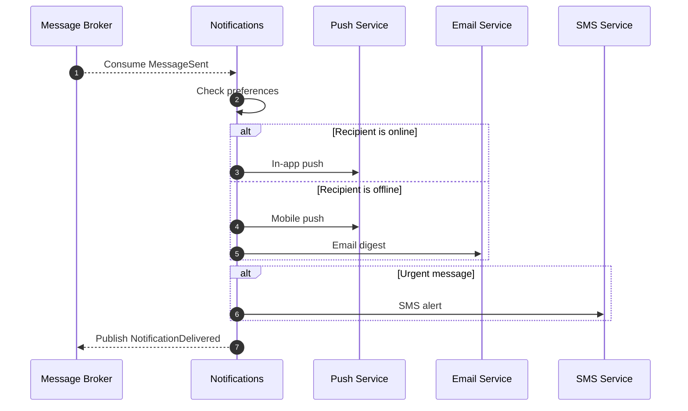

# Event Flow Diagrams

Domain events are the backbone of decoupled communication. Each flow below is split into focused diagrams so the interactions are easy to follow.

---

## Flow 1: Booking and Payment

### 1A. Client Creates Booking (Synchronous)

### 1B. Payment Processing (Async)

### 1C. Notifications & Analytics React (Async)

### 1D. Payment Failure Path

---

## Flow 2: Program Enrollment and Progress

### 2A. Coach Creates Program

### 2B. Client Enrolls

### 2C. Progress Tracking (Async Reactions)

---

## Flow 3: Communication and Notifications

### 3A. Sending a Message

### 3B. Notification Delivery

