# Component / Infrastructure Diagram

Physical deployment topology for both approaches, broken into focused diagrams.

---

## Approach A: Modular Monolith Deployment

### A1. Request Path

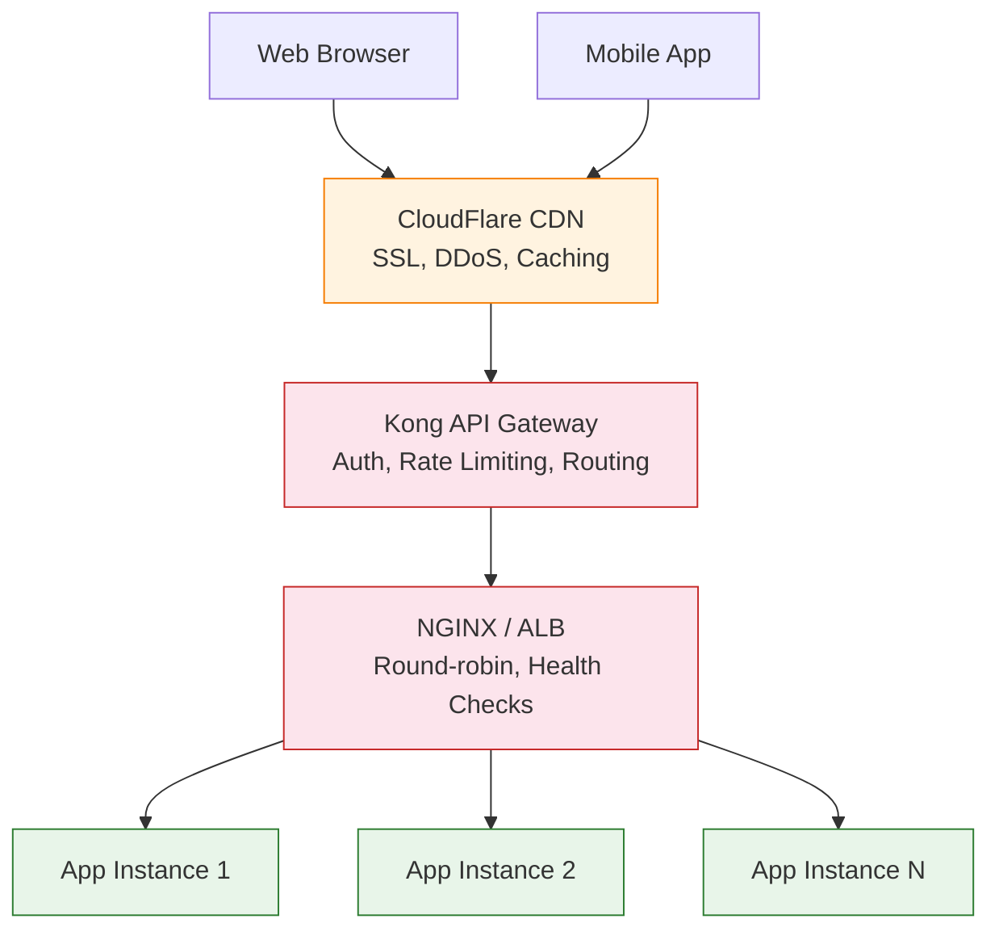

---

### A2. Internal Modules (Inside Each App Instance)

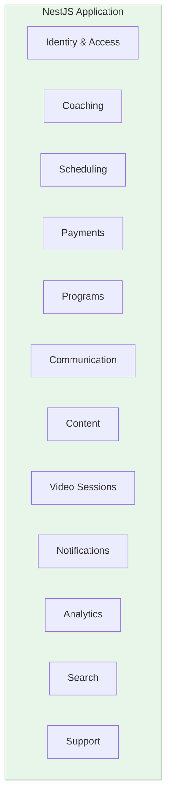

---

### A3. Data Layer

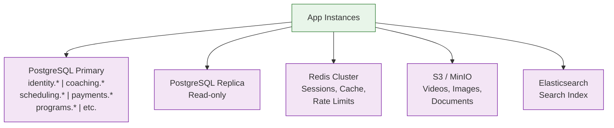

---

### A4. Async Processing

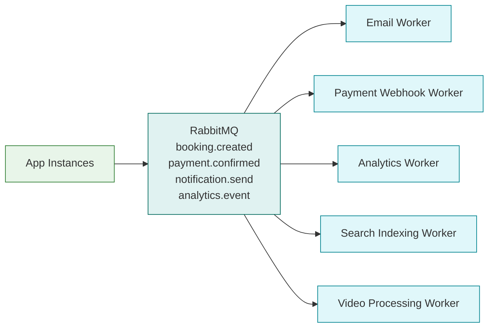

---

### A5. External Services & Observability

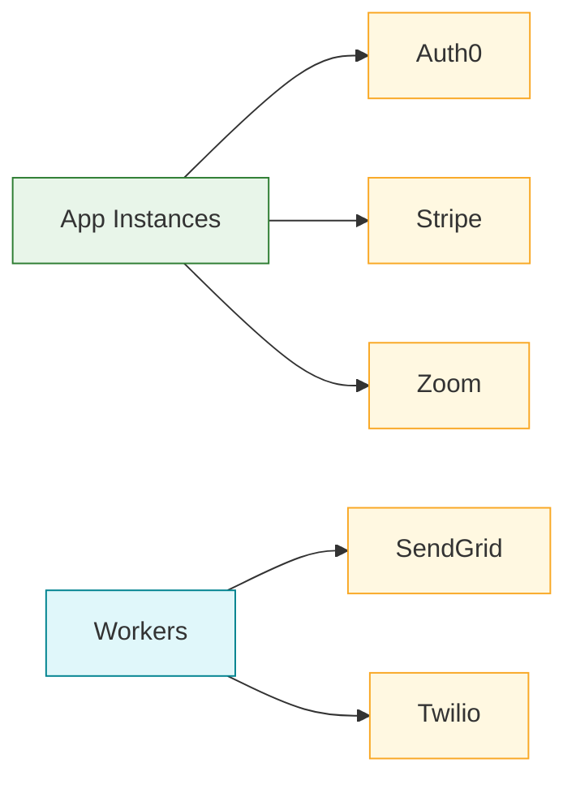

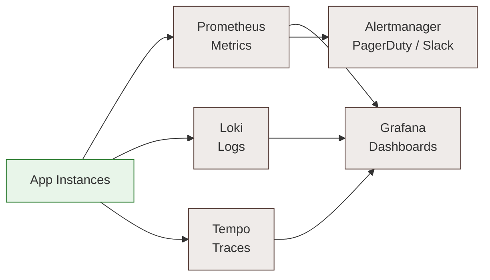

---

## Approach B: Full Microservices Deployment

### B1. Request Path

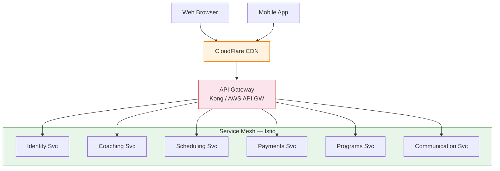

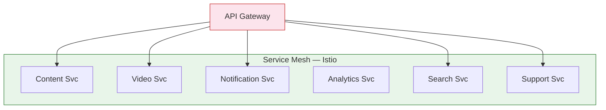

---

### B2. Database-per-Service

Each service owns its own database. No cross-service queries.

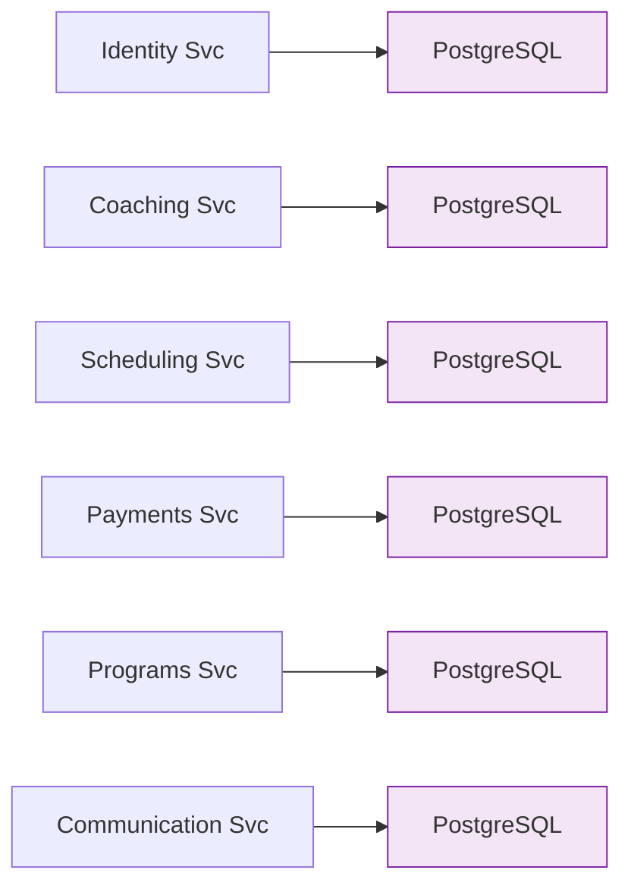

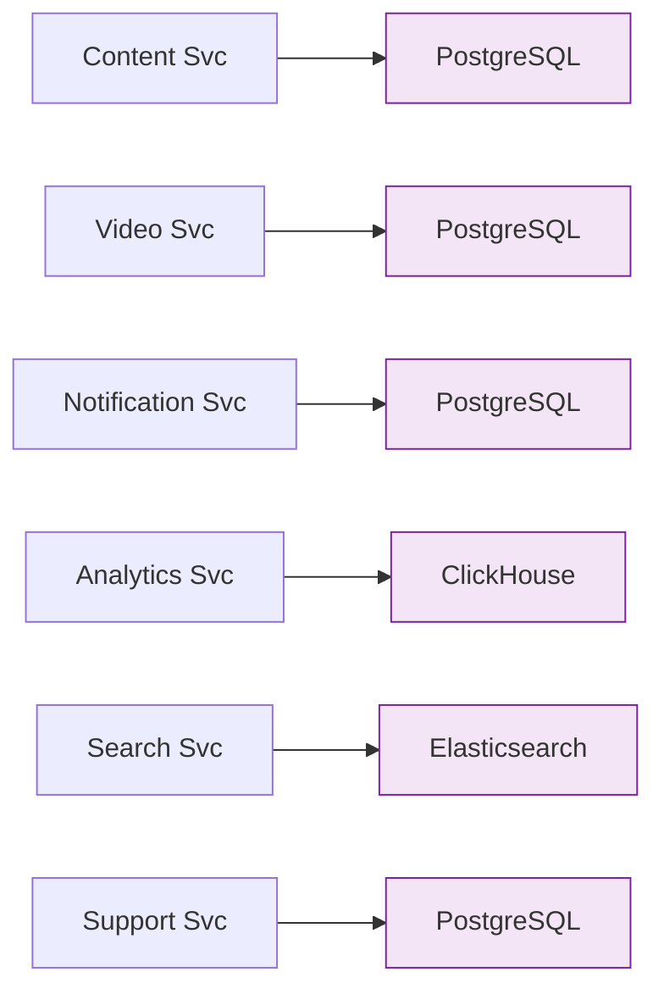

---

### B3. Event Streaming (Kafka)

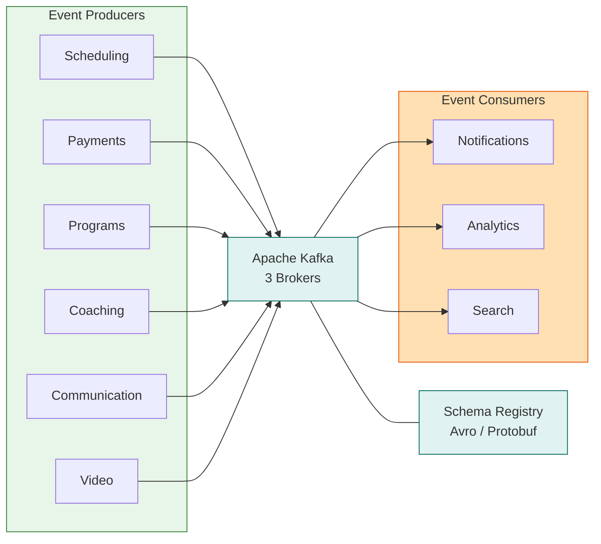

---

### B4. Shared Infrastructure & CI/CD

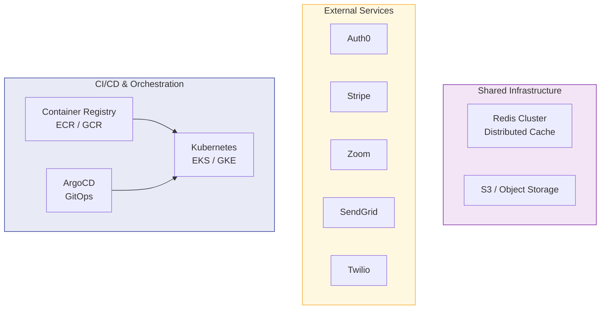

---

## Key Differences Between Approaches

| Aspect | Approach A (Modular Monolith) | Approach B (Microservices) |
|---|---|---|
| **Deployment** | Single artifact, multiple instances | 12+ independent services on Kubernetes |
| **Database** | Shared PostgreSQL with schema-per-module | Database-per-service |
| **Communication** | In-process + RabbitMQ for async | Kafka event streaming + gRPC |
| **Scaling** | Scale entire monolith horizontally | Scale individual services independently |
| **Observability** | Standard logging + Prometheus | Full distributed tracing required |
| **Complexity** | Lower operational overhead | Higher, requires service mesh + orchestration |
| **Team structure** | Single or cross-functional teams | One team per service (Conway's Law) |
| **Recommended for** | Launch to growth (< 15 engineers) | Scale stage (15+ engineers) |
