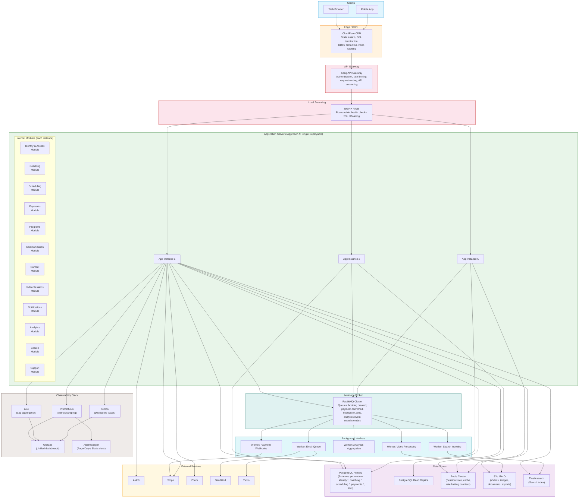

# Diagram 4: Component / Infrastructure Diagram

This diagram shows the physical deployment topology for both approaches. Approach A deploys a single application server with internal modules, while Approach B deploys each bounded context as an independent service with its own data store (database-per-service pattern).

### Approach A: Modular Monolith Deployment

### Approach B: Full Microservices Deployment

```mermaid
graph TB
    subgraph ClientLayer2["Clients"]
        Web2["Web Browser"]
        Mobile2["Mobile App"]
    end

    subgraph EdgeLayer2["Edge / CDN"]
        CF2["CloudFlare CDN"]
    end

    subgraph GatewayLayer2["API Gateway"]
        APIGW2["AWS API Gateway / Kong<br/>Service discovery, circuit breaker,<br/>auth, rate limiting, routing"]
    end

    subgraph ServiceMesh["Service Mesh (Istio / Linkerd)"]
        subgraph IdentityCluster["Identity & Access"]
            ID_Svc["Identity Service<br/>(x2 replicas)"]
            ID_DB["PostgreSQL<br/>(identity DB)"]
        end

        subgraph CoachingCluster["Coaching"]
            Coach_Svc["Coaching Service<br/>(x3 replicas)"]
            Coach_DB["PostgreSQL<br/>(coaching DB)"]
        end

        subgraph SchedulingCluster["Scheduling"]
            Sched_Svc["Scheduling Service<br/>(x3 replicas)"]
            Sched_DB["PostgreSQL<br/>(scheduling DB)"]
        end

        subgraph PaymentsCluster["Payments"]
            Pay_Svc["Payments Service<br/>(x2 replicas)"]
            Pay_DB["PostgreSQL<br/>(payments DB)"]
        end

        subgraph ProgramsCluster["Programs"]
            Prog_Svc["Programs Service<br/>(x3 replicas)"]
            Prog_DB["PostgreSQL<br/>(programs DB)"]
        end

        subgraph CommCluster["Communication"]
            Comm_Svc["Communication Service<br/>(x3 replicas)"]
            Comm_DB["PostgreSQL<br/>(communication DB)"]
        end

        subgraph ContentCluster["Content"]
            Content_Svc["Content Service<br/>(x2 replicas)"]
            Content_DB["PostgreSQL<br/>(content DB)"]
        end

        subgraph VideoCluster["Video Sessions"]
            Video_Svc["Video Service<br/>(x2 replicas)"]
            Video_DB["PostgreSQL<br/>(video DB)"]
        end

        subgraph NotifCluster["Notifications"]
            Notif_Svc["Notification Service<br/>(x2 replicas)"]
            Notif_DB["PostgreSQL<br/>(notifications DB)"]
        end

        subgraph AnalyticsCluster["Analytics"]
            Analytics_Svc["Analytics Service<br/>(x2 replicas)"]
            Analytics_DB["ClickHouse<br/>(analytics DB)"]
        end

        subgraph SearchCluster["Search"]
            Search_Svc["Search Service<br/>(x2 replicas)"]
            Search_ES["Elasticsearch<br/>(search index)"]
        end

        subgraph SupportCluster["Support"]
            Support_Svc["Support Service<br/>(x2 replicas)"]
            Support_DB["PostgreSQL<br/>(support DB)"]
        end
    end

    subgraph EventBus["Event Streaming Platform"]
        Kafka2["Apache Kafka Cluster<br/>(3 brokers)"]
        SchemaReg["Schema Registry<br/>(Avro / Protobuf schemas)"]
        KafkaTopics["Topics:<br/>booking.events<br/>payment.events<br/>program.events<br/>communication.events<br/>notification.events<br/>analytics.events"]
    end

    subgraph SharedInfra["Shared Infrastructure"]
        Redis2["Redis Cluster<br/>(Distributed cache)"]
        S3_2["S3 / Object Storage"]
    end

    subgraph ExtSvc2["External Services"]
        Auth0_2["Auth0"]
        Stripe_2["Stripe"]
        Zoom_2["Zoom"]
        SG_2["SendGrid"]
        TW_2["Twilio"]
    end

    subgraph ObsStack2["Observability"]
        Prom2["Prometheus + Thanos"]
        Loki2["Loki"]
        Tempo2["Tempo"]
        Graf2["Grafana"]
        Jaeger2["Jaeger<br/>(Trace visualization)"]
    end

    subgraph CICD["CI/CD & Orchestration"]
        K8s["Kubernetes Cluster<br/>(EKS / GKE)"]
        ArgoCD["ArgoCD<br/>(GitOps deployments)"]
        Registry["Container Registry<br/>(ECR / GCR)"]
    end

    Web2 --> CF2
    Mobile2 --> CF2
    CF2 --> APIGW2

    APIGW2 --> ID_Svc
    APIGW2 --> Coach_Svc
    APIGW2 --> Sched_Svc
    APIGW2 --> Pay_Svc
    APIGW2 --> Prog_Svc
    APIGW2 --> Comm_Svc
    APIGW2 --> Content_Svc
    APIGW2 --> Video_Svc
    APIGW2 --> Notif_Svc
    APIGW2 --> Search_Svc
    APIGW2 --> Support_Svc

    ID_Svc --> ID_DB
    Coach_Svc --> Coach_DB
    Sched_Svc --> Sched_DB
    Pay_Svc --> Pay_DB
    Prog_Svc --> Prog_DB
    Comm_Svc --> Comm_DB
    Content_Svc --> Content_DB
    Video_Svc --> Video_DB
    Notif_Svc --> Notif_DB
    Analytics_Svc --> Analytics_DB
    Search_Svc --> Search_ES
    Support_Svc --> Support_DB

    Sched_Svc --> Kafka2
    Pay_Svc --> Kafka2
    Prog_Svc --> Kafka2
    Comm_Svc --> Kafka2
    Coach_Svc --> Kafka2
    Video_Svc --> Kafka2
    Support_Svc --> Kafka2

    Kafka2 --> Notif_Svc
    Kafka2 --> Analytics_Svc
    Kafka2 --> Search_Svc
    Kafka2 --> Pay_Svc
    Kafka2 --> Sched_Svc

    Kafka2 --> SchemaReg

    ID_Svc --> Redis2
    Coach_Svc --> Redis2
    Sched_Svc --> Redis2
    Content_Svc --> S3_2
    Video_Svc --> S3_2

    ID_Svc --> Auth0_2
    Pay_Svc --> Stripe_2
    Video_Svc --> Zoom_2
    Notif_Svc --> SG_2
    Notif_Svc --> TW_2

    ServiceMesh --> Prom2
    ServiceMesh --> Loki2
    ServiceMesh --> Tempo2
    Prom2 --> Graf2
    Loki2 --> Graf2
    Tempo2 --> Graf2
    Tempo2 --> Jaeger2

    K8s --> ServiceMesh
    ArgoCD --> K8s
    Registry --> K8s

    style ClientLayer2 fill:#e1f5fe,stroke:#0288d1
    style EdgeLayer2 fill:#fff3e0,stroke:#f57c00
    style GatewayLayer2 fill:#fce4ec,stroke:#c62828
    style ServiceMesh fill:#e8f5e9,stroke:#2e7d32
    style EventBus fill:#e0f2f1,stroke:#00695c
    style SharedInfra fill:#f3e5f5,stroke:#7b1fa2
    style ExtSvc2 fill:#fff8e1,stroke:#f9a825
    style ObsStack2 fill:#efebe9,stroke:#4e342e
    style CICD fill:#e8eaf6,stroke:#283593
```

### Key Differences Between Approaches

| Aspect | Approach A (Modular Monolith) | Approach B (Microservices) |
|---|---|---|
| **Deployment** | Single artifact, multiple instances | 12+ independent services on Kubernetes |
| **Database** | Shared PostgreSQL with schema-per-module | Database-per-service (12 PostgreSQL instances + ClickHouse + Elasticsearch) |
| **Communication** | In-process method calls + RabbitMQ for async | Kafka event streaming + synchronous gRPC for queries |
| **Scaling** | Scale entire monolith horizontally | Scale individual services independently |
| **Observability** | Standard logging + Prometheus | Full distributed tracing (Tempo/Jaeger) required |
| **Complexity** | Lower operational overhead | Higher operational overhead, requires service mesh + orchestration |
| **Team structure** | Single team or cross-functional teams on shared codebase | One team per service (Conway's Law alignment) |
| **Recommended for** | Launch to growth stage, single team (< 15 engineers) | Scale stage, multiple autonomous teams (15+ engineers) |
