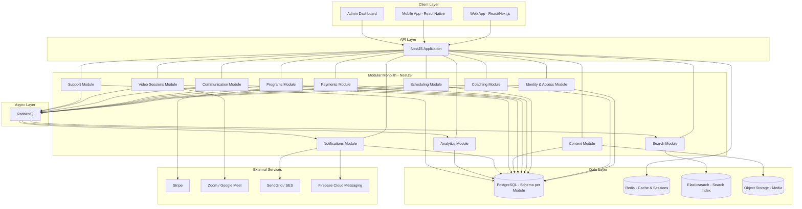

# High-Level Architecture

This section contrasts two architectural approaches for the platform. **Approach A** is recommended for production delivery. **Approach B** is presented to illustrate full microservices patterns and serve as a reference for future migration.

---

### Approach A (Recommended): Modular Monolith with Light Event-Driven Architecture

**Philosophy:** Start with a single deployable unit that enforces strong module boundaries internally. Use asynchronous messaging only where it provides clear value (decoupling, resilience, eventual consistency). This approach optimizes for developer productivity, operational simplicity, and refactoring safety.

**Key characteristics:**

| Property | Detail |
|---|---|
| Runtime | Single NestJS (or Spring Boot) application |
| Module isolation | Each bounded context is a self-contained module with its own directory, DTOs, and internal services |
| Database | Single PostgreSQL instance, one schema per module (e.g., `identity`, `coaching`, `scheduling`) |
| Cross-module communication | In-process method calls for synchronous queries; RabbitMQ for asynchronous domain events |
| Deployment | Single container (Docker), horizontally scalable behind a load balancer |
| Async broker | RabbitMQ with topic exchanges and per-consumer queues |
| API Gateway | Not required -- the monolith serves its own REST/GraphQL endpoints |

**Why this works for a coaching platform:**

- The domain is moderately complex (12 bounded contexts) but the team can start lean and scale as the platform grows.
- Transactional consistency across modules (e.g., booking + payment) is dramatically simpler within a single process.
- RabbitMQ handles the cases where true async decoupling matters: notifications, analytics, search indexing.
- Extracting a module into its own service later requires only lifting the module directory, pointing it at its own schema, and replacing in-process calls with HTTP/gRPC.

---

### Approach B: Full Microservices with Event-Driven Architecture: Full Microservices with Event-Driven Architecture

**Philosophy:** Each bounded context is an independently deployable service with its own database, CI/CD pipeline, and scaling policy. Communication is predominantly asynchronous via an event streaming platform. This approach maximizes autonomy and scalability at the cost of operational complexity.

**Key characteristics:**

| Property | Detail |
|---|---|
| Runtime | Independent services (mix of NestJS, Spring Boot, Go, Python as appropriate) |
| Module isolation | Process-level isolation -- each service is a separate deployable |
| Database | Database-per-service (PostgreSQL, MongoDB, or specialized stores) |
| Synchronous communication | REST or gRPC for queries that require immediate responses |
| Asynchronous communication | Apache Kafka for event streaming; events are the primary integration mechanism |
| Orchestration | Kubernetes with Helm charts per service |
| API Gateway | Kong, AWS API Gateway, or custom NestJS gateway for routing, auth, rate limiting |
| Observability | Distributed tracing (Jaeger), centralized logging (ELK), metrics (Prometheus + Grafana) |

**Why this approach exists (and when it is justified):**

- It implements real-world patterns used by large organizations (Netflix, Uber, Spotify).
- It requires developers to think about service boundaries, eventual consistency, and failure modes.
- It leverages essential infrastructure: service discovery, circuit breakers, distributed tracing, saga orchestration.
- However, the operational overhead is significant and often unjustified for teams smaller than 20-30 engineers.

```mermaid
graph TB
    subgraph "Client Layer"
        WEB[Web App - React/Next.js]
        MOBILE[Mobile App - React Native]
        ADMIN[Admin Dashboard]
    end

    subgraph "Infrastructure Layer"
        APIGW[API Gateway - Kong]
        SD[Service Discovery - Consul]
        CB[Circuit Breaker - Resilience4j]
    end

    subgraph "Microservices - Kubernetes Cluster"
        direction TB
        SVC_IAM[Identity Service - NestJS]
        SVC_COACH[Coaching Service - NestJS]
        SVC_SCHED[Scheduling Service - NestJS]
        SVC_PAY[Payments Service - Spring Boot]
        SVC_PROG[Programs Service - NestJS]
        SVC_COMM[Communication Service - NestJS]
        SVC_CONT[Content Service - Go]
        SVC_VIDEO[Video Service - NestJS]
        SVC_NOTIF[Notification Service - NestJS]
        SVC_ANALYTICS[Analytics Service - Python]
        SVC_SEARCH[Search Service - Go]
        SVC_SUPPORT[Support Service - NestJS]
    end

    subgraph "Event Streaming"
        KAFKA[Apache Kafka Cluster]
        SR[Schema Registry - Avro]
    end

    subgraph "Data Stores - Each Service Owns Its DB"
        DB_IAM[(PostgreSQL - Identity)]
        DB_COACH[(PostgreSQL - Coaching)]
        DB_SCHED[(PostgreSQL - Scheduling)]
        DB_PAY[(PostgreSQL - Payments)]
        DB_PROG[(PostgreSQL - Programs)]
        DB_COMM[(MongoDB - Communication)]
        DB_CONT[(S3 + PostgreSQL - Content)]
        DB_VIDEO[(PostgreSQL - Video)]
        DB_NOTIF[(PostgreSQL - Notifications)]
        DB_ANALYTICS[(ClickHouse - Analytics)]
        DB_SEARCH[(Elasticsearch - Search)]
        DB_SUPPORT[(PostgreSQL - Support)]
    end

    subgraph "Observability"
        JAEGER[Jaeger - Tracing]
        ELK[ELK Stack - Logging]
        PROM[Prometheus + Grafana - Metrics]
    end

    WEB --> APIGW
    MOBILE --> APIGW
    ADMIN --> APIGW

    APIGW --> SVC_IAM
    APIGW --> SVC_COACH
    APIGW --> SVC_SCHED
    APIGW --> SVC_PAY
    APIGW --> SVC_PROG
    APIGW --> SVC_COMM
    APIGW --> SVC_CONT
    APIGW --> SVC_VIDEO
    APIGW --> SVC_NOTIF
    APIGW --> SVC_ANALYTICS
    APIGW --> SVC_SEARCH
    APIGW --> SVC_SUPPORT

    SVC_IAM --> DB_IAM
    SVC_COACH --> DB_COACH
    SVC_SCHED --> DB_SCHED
    SVC_PAY --> DB_PAY
    SVC_PROG --> DB_PROG
    SVC_COMM --> DB_COMM
    SVC_CONT --> DB_CONT
    SVC_VIDEO --> DB_VIDEO
    SVC_NOTIF --> DB_NOTIF
    SVC_ANALYTICS --> DB_ANALYTICS
    SVC_SEARCH --> DB_SEARCH
    SVC_SUPPORT --> DB_SUPPORT

    SVC_IAM --> KAFKA
    SVC_COACH --> KAFKA
    SVC_SCHED --> KAFKA
    SVC_PAY --> KAFKA
    SVC_PROG --> KAFKA
    SVC_COMM --> KAFKA
    SVC_VIDEO --> KAFKA
    SVC_SUPPORT --> KAFKA

    KAFKA --> SVC_NOTIF
    KAFKA --> SVC_ANALYTICS
    KAFKA --> SVC_SEARCH

    KAFKA --> SR

    SVC_IAM --> JAEGER
    SVC_COACH --> JAEGER
    SVC_SCHED --> JAEGER
    SVC_PAY --> JAEGER
```

---

### Comparison Table: Approach A vs. Approach B

| Dimension | Approach A -- Modular Monolith | Approach B -- Full Microservices |
|---|---|---|
| **Deployment complexity** | Low -- single container, simple CI/CD | High -- 12+ containers, Helm charts, K8s |
| **Team size fit** | Up to ~15 developers | 15-50+ developers |
| **Cross-module transactions** | Simple -- in-process, single DB transaction | Complex -- Saga pattern, compensating actions |
| **Latency (inter-module)** | Nanoseconds (in-process calls) | Milliseconds (network calls + serialization) |
| **Schema evolution** | Coordinated migrations, single DB | Independent per service, schema registry |
| **Operational overhead** | Minimal -- one app to monitor | Significant -- distributed tracing, log aggregation, service mesh |
| **Scalability** | Vertical + horizontal (whole app) | Granular -- scale individual services |
| **Fault isolation** | Module failure can crash the process | Service failure is contained |
| **Developer onboarding** | Fast -- single codebase, single repo | Slow -- must understand infra, messaging, multiple repos |
| **Refactoring to microservices** | Straightforward -- modules have clean boundaries | Already there |
| **Cost (infrastructure)** | Low -- single VM / small cluster | High -- K8s cluster, Kafka cluster, multiple DBs |

**Recommendation:** Start with Approach A. Establish clean module boundaries from day one. Extract modules into services only when a specific module needs independent scaling, a different technology stack, or team ownership isolation.
