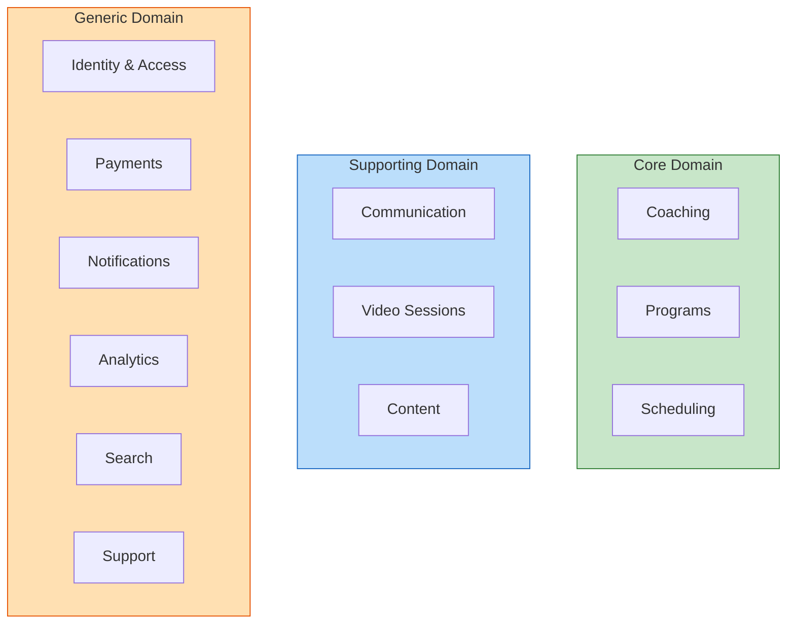
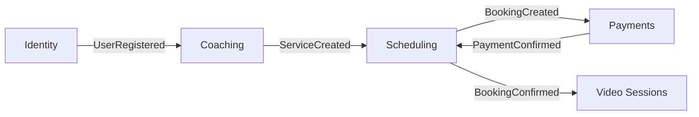
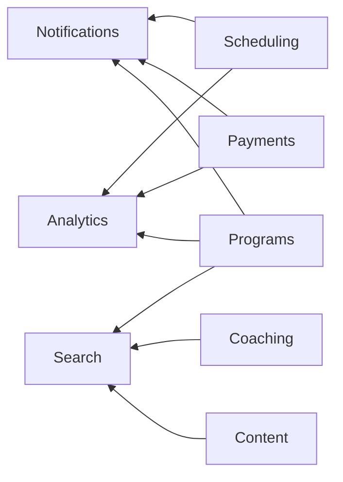

# Bounded Contexts (DDD)

The platform is decomposed into 12 bounded contexts, each representing a cohesive area of the business domain. This section defines each context's responsibilities, core entities, domain events, and relationships.

---

### Context Map Overview

**Domain Classification:**

**Core Event Flow — Booking & Payment:**

**Event Consumers — Notifications, Analytics, Search:**

---

#
